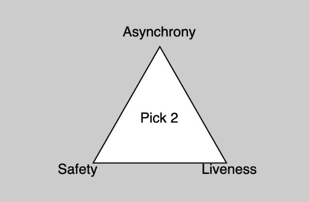
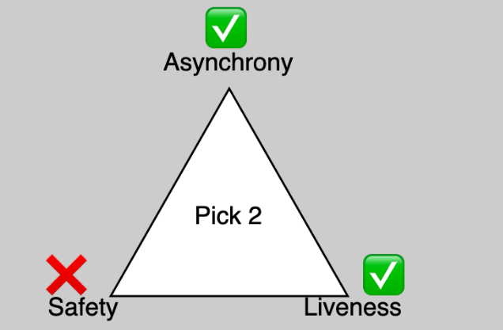

## 三元悖论

[FLP不可能性](https://groups.csail.mit.edu/tds/papers/Lynch/jacm85.pdf)（FLP impossibility）是分布式计算领域的一个关键成果，其指出**分布式系统不可能同时具有安全性\(safety\)、活性\(liveness\)和完全异步性\(full asynchrony\)**，除非是在对系统做出不合理假设的情况下。

**安全性**指决定不能被撤销，**活性**则指针对新事物做出决定。如果在信息传递中没有时间限制，那么该协议是**异步**的。  

如果节点能够可靠地进行通信，始终诚实地遵循协议且永不宕机，那么要达成共识非常容易，但这不是真实情况。当这些假设不成立时，FLP不可能性证明了至少要折衷以下三者中的一项：安全性、活性或完全异步性。  

## 分叉选择规则：GHOSTs

Eth2使用[Greedy Heaviest Observed Subtree](https://eprint.iacr.org/2013/881.pdf) \(GHOST，贪婪最重可观察子树协议\) 作为其分叉选择规则。在GHOST协议中，获得投票数最高的分叉将被选为链头（将每个分叉区块及其各自子区块的所有票数计入考虑）。

[换句话说](https://vitalik.ca/general/2018/12/05/cbc_casper.html)，每当发生分叉时，GHOST会选择获得更多消息支持的区块子树（多数最近消息要么支持该区块，要么支持该区块的其中一个子区块）。此算法会一直重复这种操作，直至达到没有子区块的区块。

与最长链规则相比， GHOST的优点在于能够在网络延迟较高时降低攻击效率，同时最小化链重组的深度。原因是即使攻击者能够高效地在其分叉链上继续产生区块，尝试使该链成为最长链，GHOST也会选择另一条票数更高的分叉链。

具体来说，Eth2在其PoS机制中采用了GHOST的一个变体，即**Latest Message Driven GHOST \(LMD-GHOST，由最新消息驱动的GHOST\)**。LMD-GHOST背后的理念是计算链头时，只需考虑每个验证者最近的投票，而不是过去产生的任何投票。这种方式极大地减少了运行GHOST所需的计算量，因为执行分叉选择规则时需要考虑的分叉数量，不可能大于验证者的数量（Big O表示法中的O\(v\)）。

在GHOST的规则中，验证者/矿工随时可以在区块链上添加新的区块（活性），并且可以在区块链历史中的任何时间点进行这种操作（异步性）。因此**基于GHOST协议的区块链具备活性和完全异步性，根据FLP不可能性，我们可以推断出其安全性会大打折扣。**

安全性的折衷会以区块重组的形式表现出来，区块链可能会突然跨深度任意切换分叉。这显然是不理想的状况，eth1链应对这种情况的方式是让用户假设矿工的区块需要多久才能被全网接收到，因此交易需要等待x个确认。然而eth2并不会做出此类假设。  

## 友好的确定性小工具（FFG）

失去安全性的区块链是无效的，因为无法针对任何决定达成共识，用户也无法就链的状态达成一致。[Casper the Friendly Finality Gadget](https://arxiv.org/pdf/1710.09437.pdf) \(Casper FFG\)便因此诞生。Casper FFG机制在做出决策的时候更倾向于保障安全性而非活性。这就意味着虽然Casper FFG能做出最终性决策，但如果网络状态不理想，它可能无法就任何事情做出决策。  
FFG机制是经典[实用拜占庭容错](http://pmg.csail.mit.edu/papers/osdi99.pdf)（PBFT）在加密经济学领域的一种应用，首先节点表示他们想要就某事达成一致（justification），然后就彼此之间达成的一致性形成共识（finalisation）。

Eth2并不会在每个slot（一个区块生成的预计时间）都进行证明和最终确认，而是每32个slots进行证明和最终确认，每32个slots就称为一个epoch。首先，验证者要对一个epoch中的所有32个区块进行签名，表示就此达成一致。如果2/3的验证者进行了签名，那么这些区块就得到了证明。在后一个epoch中，验证者们会进行一次投票，表明他们看见了之前被证明的epoch，如果有2/3的验证者投票，那么前一个epoch就被最终确定，并且永久地成为Eth2链的一部分。

FFG这种方式十分高明。投票实际上由两个子投票构成，一个用于证明epoch，另一个用于对证明过后的epoch进行最终确认。这节省了很多节点之间额外的通信需求，有助于实现将网络规模扩大至数百万验证者的目标。  

## “同袍同泽”的共识机制

Eth2的共识既仰赖于LMD-GHOST机制（增加新区块，决定区块链链头），也仰赖于Casper FFG机制（最终决定哪些区块成为区块链的一部分）。GHOST强调活性，能够快速高效地将区块添加进区块链，而FFG则与GHOST相辅相成，通过对epochs进行最终确定，弥补了安全性的缺失。  

**那么这两个协议是如何合并的呢？**具体方式是在基于FFG被最终确认的最近一个区块中运行GHOST。因此，最近一个基于FFG被最终确定的区块总会是区块链的一部分，也就是说GHOST并不需要考虑之前的区块。

正常情况下，区块生成之后获得了2/3的验证者的投票，那么这些区块将通过GHOST协议被添加到区块链的头部，之后，这些区块就会通过FFG被证明和最终确定，而FFG会考虑最近的几个epochs。

如果网络受到攻击，且/或很大一部分的验证者离线，GHOST还是会继续添加新区块。由于GHOST注重活性且缺乏安全性，随着新区块被不断添加进区块链中，可能会对区块链头部进行更改，这意味着节点会持续获取新的信息。另一方面，FFG相比活性更注重安全性，也就是说在网络足够稳定（验证者能够再次进行一致性投票）之前，FFG将停止对区块进行最终确认。

## 参考来源

[Validated, staking on eth2: \#2 - Two ghosts in a trench coat](https://blog.ethereum.org/2020/02/12/validated-staking-on-eth2-2-two-ghosts-in-a-trench-coat/) by Carl Beekhuizen

